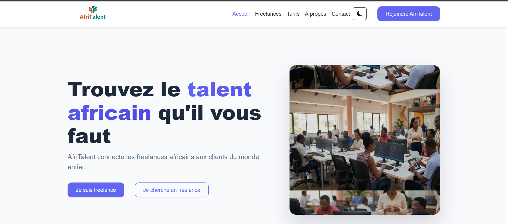
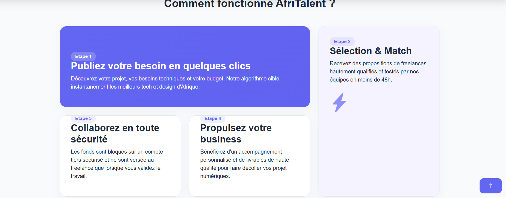

# AfriTalent

Projet fil rouge — Plateforme de mise en relation entre freelances africains et
clients.

Auteur : Ndeye Absa Gadiaga
Promotion : L2 Web — ISI

## Présentation

AfriTalent est une plateforme web mettant en relation des freelances Africains et des clients à la recherche de compétences numériques. 
Le projet a été réalisé dans le cadre d'un apprentissage web avec HTML, CSS, Bootstrap et JavaScript.

## Fonctionnalités

- Navigation responsive
- Mode clair et sombre
- Cartes de services interactives
- Compteurs animés au défilement
- Animations d'apparition des sections
- Grille de profils de freelance
- Filtrage dynamique des freelances
- Validation du formulaire de contact
- Bouton retour en haut de page

## Technologies utilisées

- Structure HTML
- Mise en page CSS
- Utilisation de Bootstrap
- JavaScript
- Git & GitHub

## Structure du projet

- index.html : page d'accueil
- freelances.html : catalogue des freelances
- tarifs.html : présentation des offres
- about.html : présentation de l'entreprise
- contact.html : formulaire de contact
- css/style.css : feuille de style principale
- js/main.js : scripts JavaScript

## Caputes d'écran

## Deploiement

 Le site est accessible à l'addresse suivante :

https://gadiaga196.github.io/-Gadiaga-Ndeye-Absa-AfriTalent/
